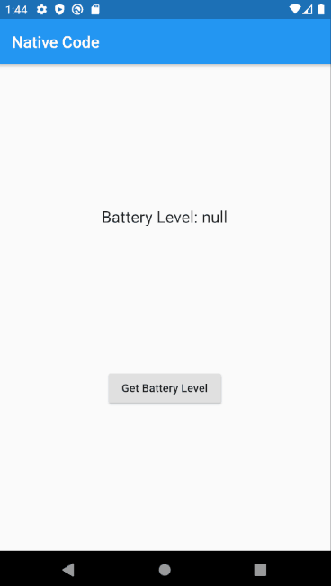

# battery_level

A simple mobile app that demonstrates how to run native ObjectiveC and Java code in Flutter. The app gets the current battery level of the device on which it is running. The implementation follows the instructions from this [writing custom platform-specific code](https://flutter.dev/docs/development/platform-integration/platform-channels) documentation.

