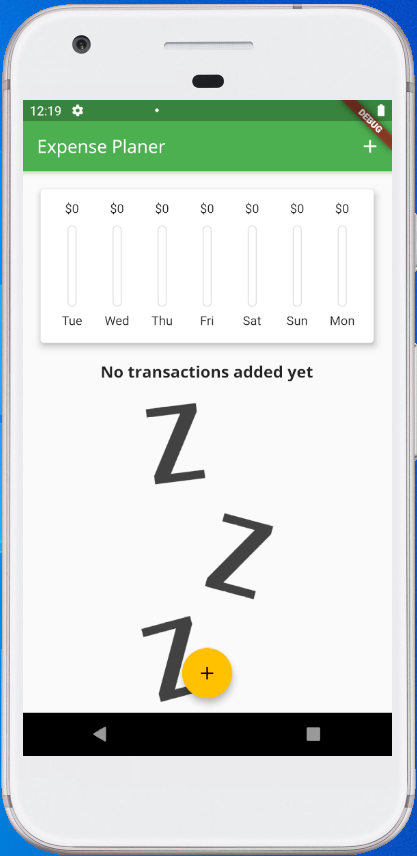
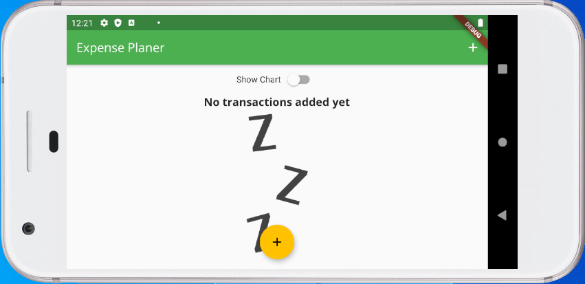
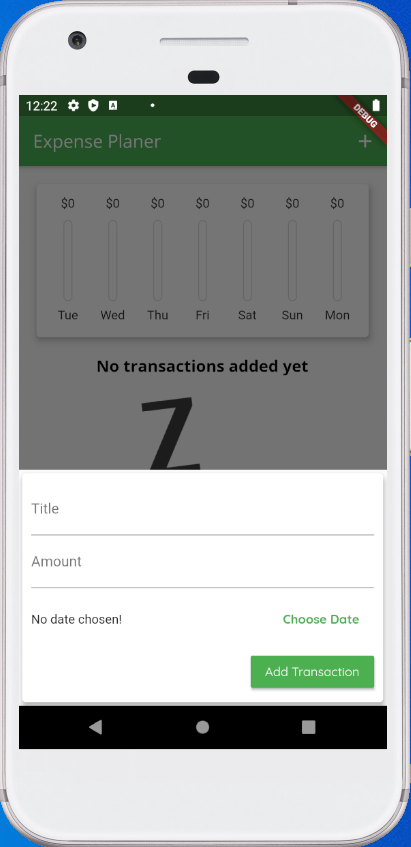
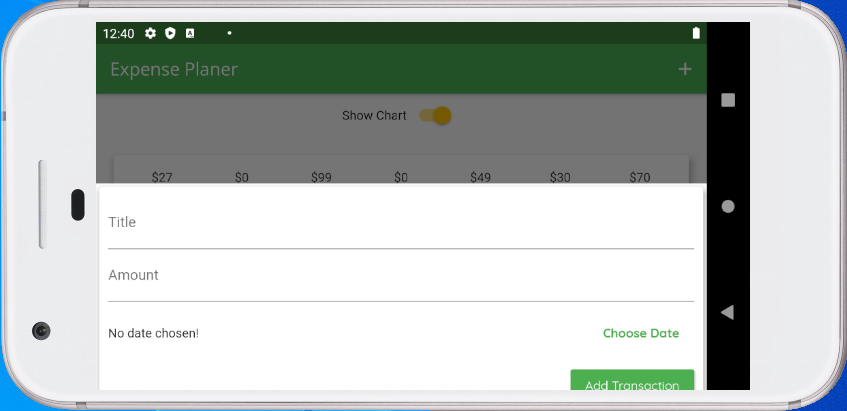
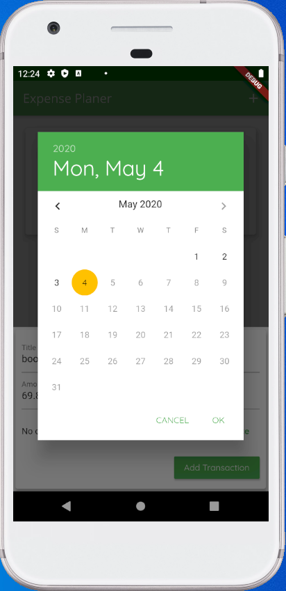
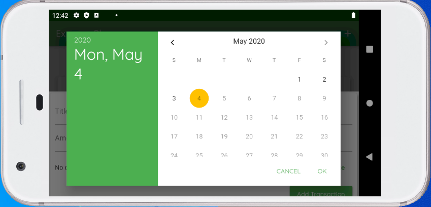
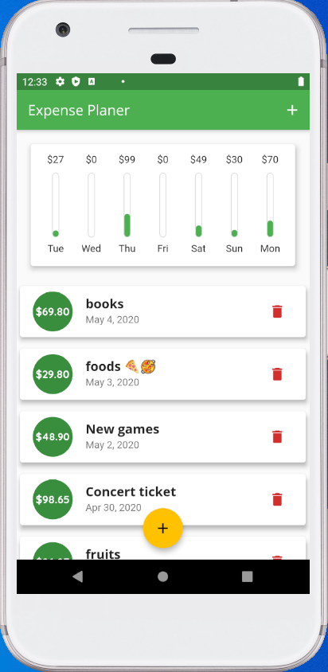
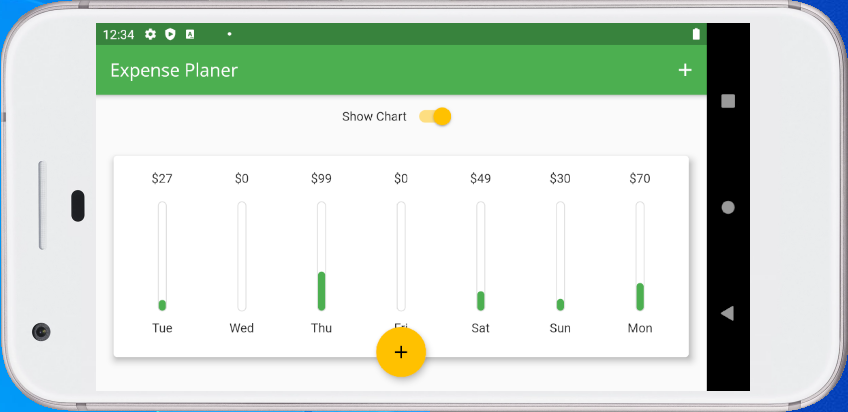
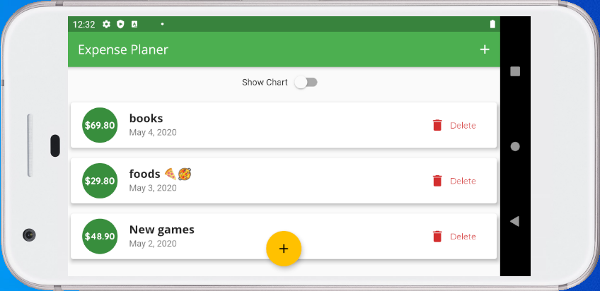

# expense planner mobile app

Create a smartphone app that can run on both Android and iOS. The app
allows users to list all daily-life buying transactions and shows up
a chart depicting how much money was used in these transactions during each day of the most recent 7 days. Below is some of the snapshots of the app.

|Portrait  |Landscape  |
|---------|---------|
|| |
|| |
|| |
||  |
