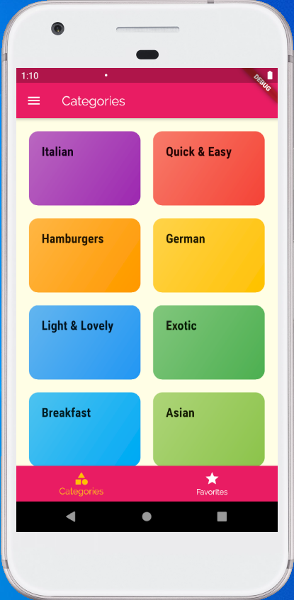
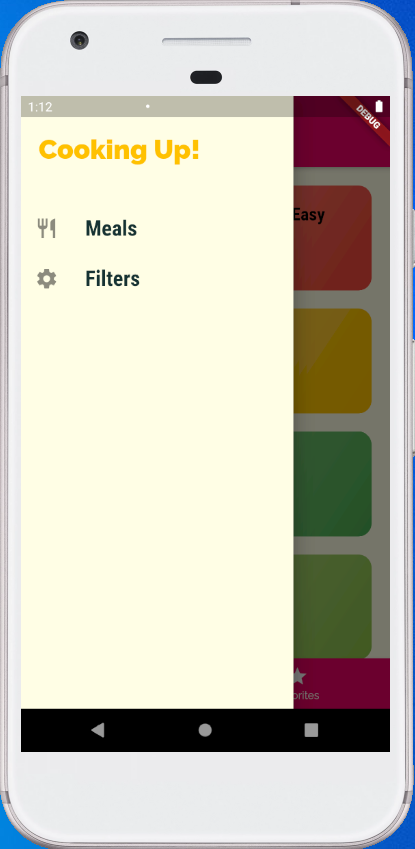
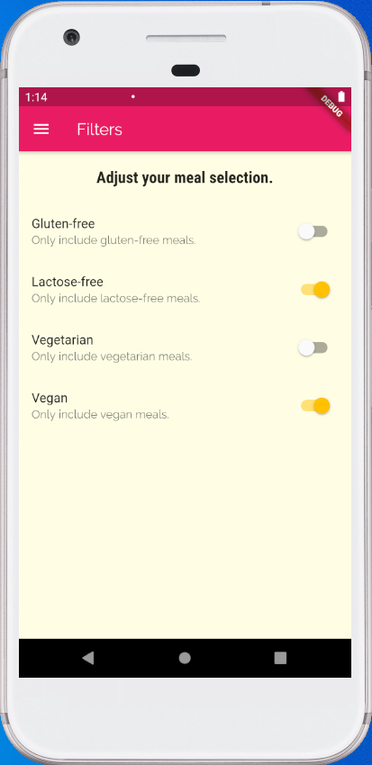
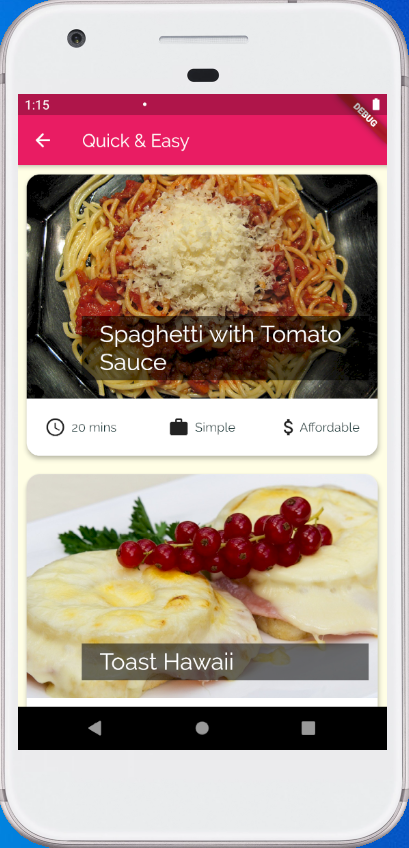
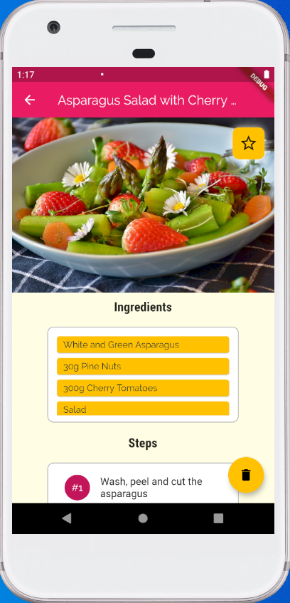
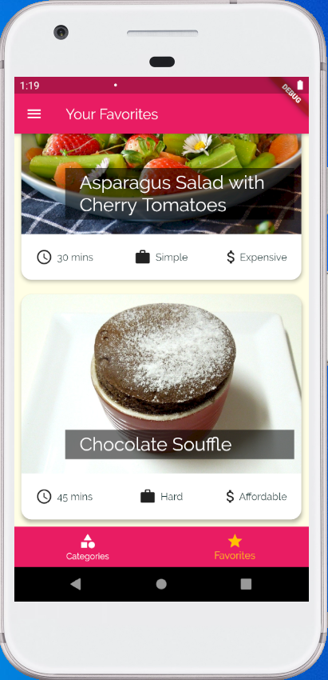

# food_menu

A simple mobile application that has the following functionalities:

* Show a list of food categories (also called meal categories, i.e. Summer, Germany, Italian, ...)
* Show a list of meals for each food category
* Show meal details (picture, ingredients, cooking steps)
* User can mark a meal as favorite
* Can setup filters to specify what type of meals for which want to search

## Screen snapshots

|1 Categories |2 Drawer |3 Filters |
|---------|---------|---------|
||||
|4 Meals |5 Meal Detail |6 Favorites |
||||
