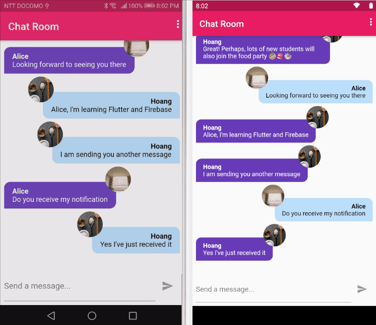

# instant_chat

A simple intant chat application that can run on both Android and iOS. The app provides the following functionalities:

* Authentication (signup, login, logout)
* Sending and/or receiving chat messages to/from multiple users instantly
* Sending and receiving notification when new messages are sent by other users

## Snapshots

|Authentication |Send and receive chat messages |
|---------|---------|
| | |
||Automatic notifications |
|| |
