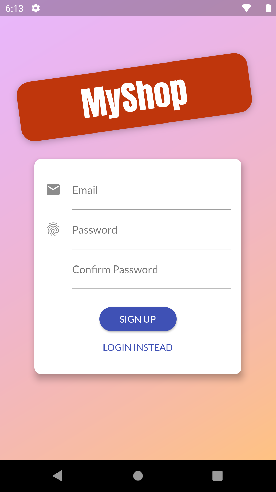
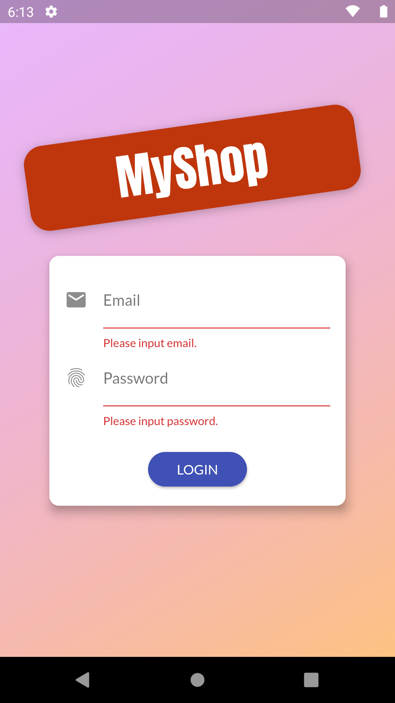
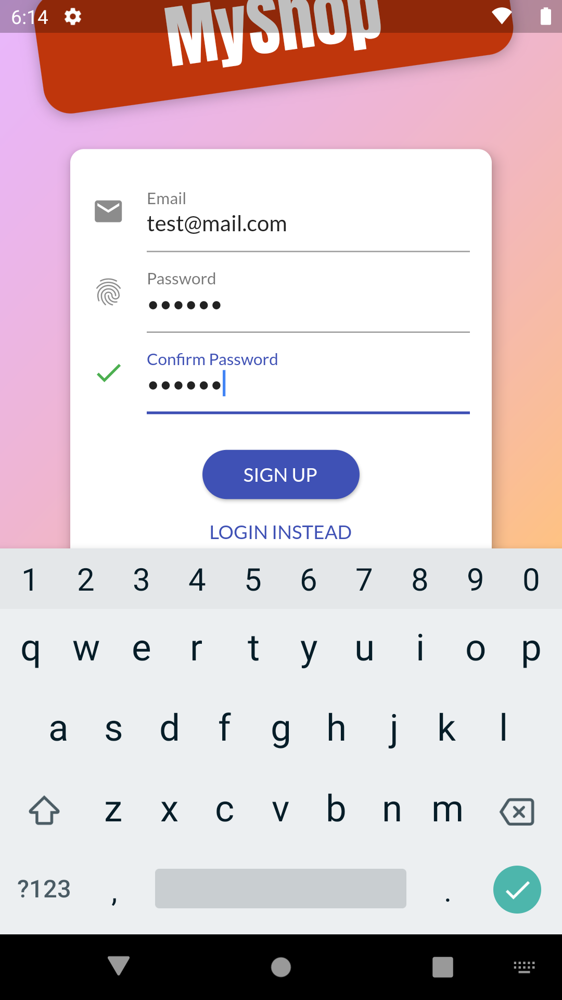
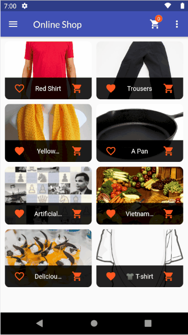
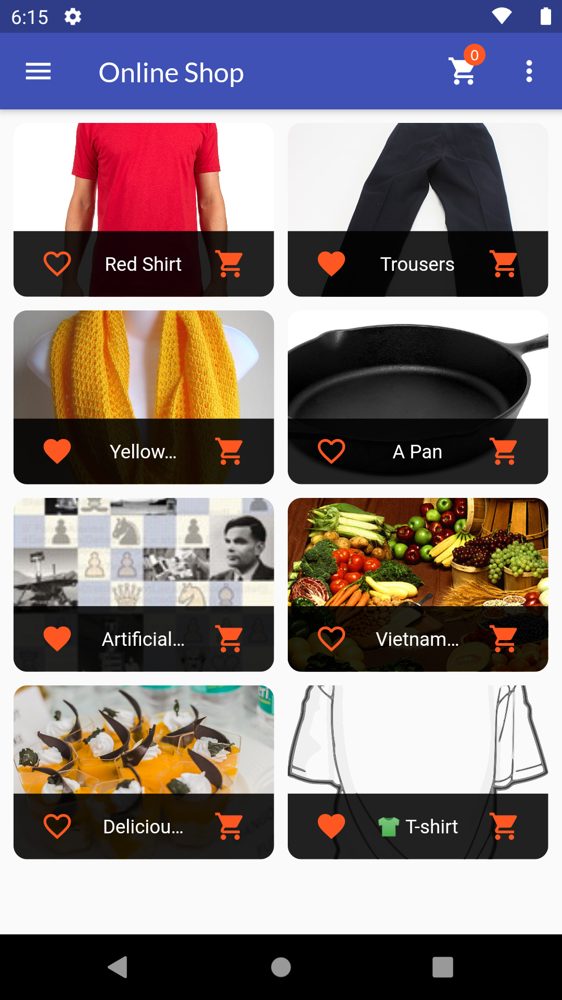
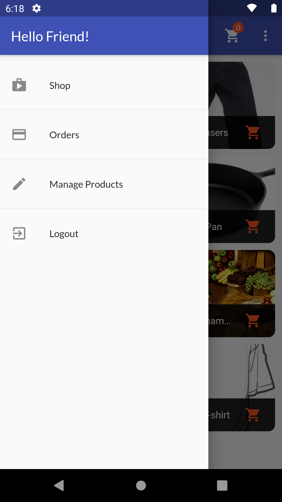
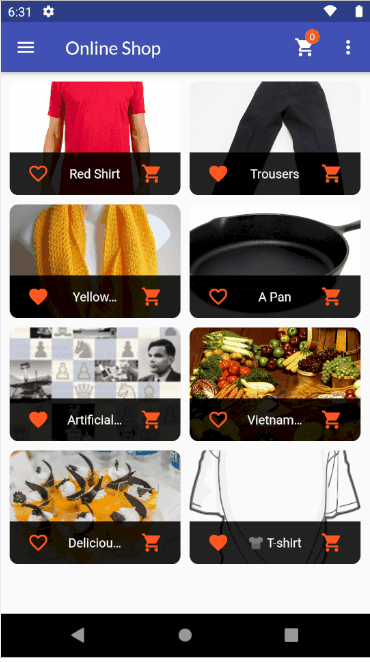
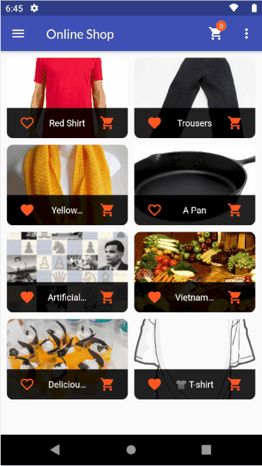
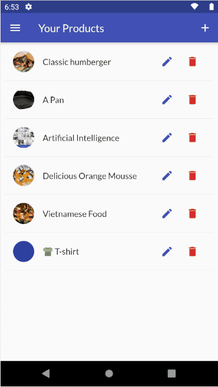
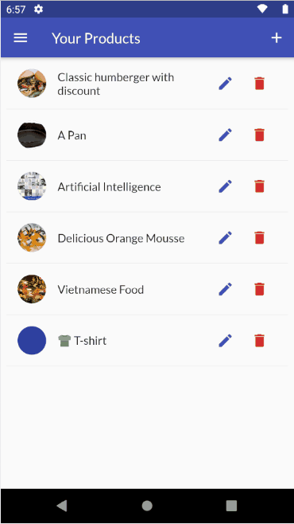

# online_shop

Create a simple online shopping app that provides the following functionalities

* Sign-up, login, logout
* Also provide auto login when opening the app again, and auto logout when a specific period of time has passed
* View all products that are being sold
* Make purchase orders (no payment at this time), and view orders history
* Add/update/delete products that are being managed by users (each user can only update/delete products that he/she added before)
* Mark products as favorite and filter out favorite products
* View product details

The app persists the data in a [Firebase](https://firebase.google.com/) Realtime Database.

## List of Main Screens

|Sign Up  |Login |Handle Authentication Form Error |
|---------|---------|---------|
| | | |
|Sign Up Form |Logout and Re-Login |Product Overview Screen |
| | | |
|Left-hand-side Drawer Menu |Product Detail Screen |Place an Order |
| | | |
|Add a New Product to the Shop |Update Product Information |Delete a Product from the Shop |
| | | |
